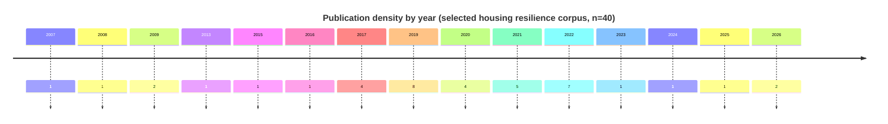
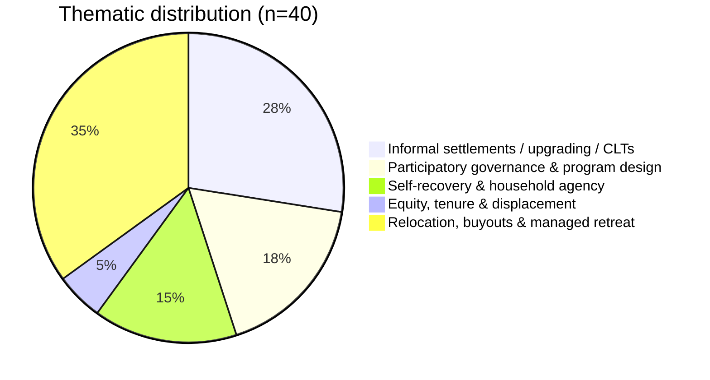

# Community Restoration and Transformative Approaches to Housing Resilience in Peer‑Reviewed Scholarship 2006–2026

## Executive summary

This report curates and analyzes a thematically organized set of **40 scholarly items (2007–2026)** that explicitly connect **community restoration and/or transformation** to **housing resilience** across disaster recovery, climate adaptation, informality, managed retreat, buyouts, and housing governance. The corpus is dominated by peer-reviewed journal articles and includes a small number of closely related scholarly records where they are assigned to this theme in the project bibliography. The corpus is **international**, but it is not geographically even: the strongest coverage appears for the **United States**, **Latin America**, and parts of the **Global South** where post-disaster housing reconstruction (PDHR), informal settlement upgrading, and relocation politics are frequent policy arenas (e.g., Indonesia, Brazil, Egypt, Puerto Rico).

Across themes, the literature shifts housing resilience away from a purely technical property of structures and toward a **socially produced capacity** embedded in governance, tenure, finance, and participation. Participation is treated less as consultation than as co-production; build-back-better claims are tested against long-term vulnerability and lived recovery; equity and tenure are foregrounded as determinants of who can return, rebuild, relocate, or remain; managed retreat and buyouts are reframed as justice-laden transformations rather than only hazard-mitigation tools; and community land, collective tenure, and upgrading are repositioned as adaptation pathways that can reduce exposure without deepening displacement.

The evidence base is methodologically diverse (comparative case studies, qualitative fieldwork, conceptual frameworks, meta‑analysis/synthesis, statistical modeling, and configurational approaches such as fsQCA). Yet there are notable gaps: comparatively fewer peer‑reviewed housing‑resilience studies integrate **Indigenous sovereignty**, **rural housing systems**, **Global South rental markets**, or **experimental/quasi‑experimental policy evaluation** beyond specific funding programs.

## Scope and selection method

The requested window is interpreted as **2006–2026**. In practice, the verified scholarly set assembled here spans **2007–2026**, prioritizing peer-reviewed articles and closely related scholarly records whose central focus includes **housing recovery/reconstruction**, **housing tenure/land**, **settlement upgrading**, **managed retreat/buyouts**, or **housing system resilience**, and that make a substantive claim about **community restoration** (return, reconstitution of social life, reintegration) or **transformation** (changes in governance, land/tenure regimes, planning logics, or justice outcomes).

The initial corpus was built from open-web discovery because subscription database exports were not available for this pass. The corpus uses publisher pages and platform records for peer-reviewed articles, open repositories for eligible content, and journal open-access portals or institutional repositories hosting author-licensed versions. Each included paper is supported by at least one source containing bibliographic metadata and/or abstract text.

## Thematic synthesis

Within housing‑resilience scholarship, “community restoration” is most often operationalized as **return and rehousing trajectories**, **stabilization of populations**, **reconstitution of neighborhoods**, and **delivery of durable shelter/housing outcomes**. “Transformation” is most often operationalized as **shifts in governance/participation (who decides)**, **shifts in tenure/land control (who can remain)**, and **shifts in risk posture (rebuild in place vs. relocate/retreat)**—including justice claims about distributional and procedural outcomes.

A key cross‑theme analytic point is that housing resilience repeatedly appears as a **system property** rather than a unit‑dwelling property. For example, housing recovery is shown to depend on market financing and insurance systems, regulatory environments, and the politics of participation—not merely on structure repair.

## Annotated bibliography organized by themes

Formatting note: Each entry provides (i) full bibliographic details, (ii) an abstract‑based 2–3 sentence summary, and (iii) analytic fields requested (keywords, geography, methods, frameworks, findings, and the “reimagining” contribution). “OA” indicates open‑access availability on the cited source page.

### Theme cluster on participatory governance and program design in housing recovery

**Davidson, C. H., Johnson, C., Lizarralde, G., Dikmen, N., & Sliwinski, A. (2007).** Truths and myths about community participation in post-disaster housing projects. *Habitat International*, 31(1), 100–115. DOI: 10.1016/j.habitatint.2006.08.003. 
Summary: This paper critically examines what “community participation” does (and does not) achieve in post‑disaster housing, challenging idealized assumptions and documenting how participation can be constrained by institutional design and power asymmetries. It reframes participation as a variable with trade‑offs rather than an automatic pathway to better outcomes. 
Keywords: participation; post‑disaster housing; reconstruction; governance (author keywords). 
Geographic focus: cross‑case synthesis (international). 
Methods: critical analytic review / conceptual synthesis. 
Frameworks: participation theory and reconstruction governance critique. 
Key findings: participation is often overstated; participation quality depends on who controls decisions and resources; poorly structured participation can fail to deliver intended empowerment outcomes. 
Reimagining contribution: shifts “restoration” from rebuilding structures to rebuilding decision‑making capacity—while warning against participation-as-rhetoric.

**Lizarralde, G., & Massyn, M. (2008).** Unexpected negative outcomes of community participation in low-cost housing projects in South Africa. *Habitat International*, 32(1), 1–14. DOI: 10.1016/j.habitatint.2007.06.003. 
Summary: Using low‑cost housing contexts, the authors show that participation can generate unintended outcomes, including new conflicts and exclusions, when power and expectations are misaligned. They argue for participation designs that explicitly address representation and accountability, not only inclusion. 
Keywords: community participation; low‑cost housing; unintended consequences; governance (as described in article framing). 
Geographic focus: **South Africa**. 
Methods: case‑based empirical analysis (project experience/qualitative evaluation). 
Frameworks: participation and governance critique. 
Key findings: “participation” can be instrumentalized; without safeguards, it can reproduce inequities in housing delivery. 
Reimagining contribution: reframes transformative housing resilience as requiring conflict‑aware institutional design, not merely community involvement.

**Ganapati, N. E., & Ganapati, S. (2009).** Enabling participatory planning after disasters: A case study of the World Bank’s housing reconstruction in Turkey. *Journal of the American Planning Association*, 75(1), 41–59. DOI: 10.1080/01944360802546254. 
Summary: Through a housing reconstruction case in Turkey, this article identifies barriers that limited public participation despite formal planning intentions. It proposes concrete ways planners can better enable participatory planning during recovery when time pressures and institutional constraints are high. 
Keywords: participatory planning; post‑disaster recovery; housing reconstruction (derived from article description). 
Geographic focus: **Turkey** (Gölcük/Şirinköy after the 1999 Marmara earthquake). 
Methods: qualitative case study (secondary review plus field‑based qualitative inquiry as described). 
Frameworks: participatory planning and post‑disaster planning implementation. 
Key findings: participation is hindered by institutional practices and project structures; enabling participation requires intentional design, not only procedural invitations. 
Reimagining contribution: reframes community restoration as a planning capability and legitimacy project, not only a rebuilding project.

**Bilau, A. A., Witt, E., & Lill, I. (2017).** Analysis of measures for managing issues in post-disaster housing reconstruction. *Buildings*, 7(2), Article 29. DOI: 10.3390/buildings7020029. *(OA)* 
Summary: Based on expert elicitation and synthesis, this study identifies practice‑relevant measures for managing persistent implementation issues in permanent housing reconstruction programs. It translates recurring PDHR problems into actionable management measures for agencies and governments. 
Keywords: post‑disaster housing reconstruction; program management; reconstruction issues (as described). 
Geographic focus: global / multi‑context (practice‑oriented). 
Methods: expert opinion survey and best‑practice synthesis. 
Frameworks: reconstruction program management; implementation problem typologies. 
Key findings: persistent issues in PDHR can be mapped to specific management interventions; policy design and project governance materially shape recovery outcomes. 
Reimagining contribution: reframes resilience as a capacity of reconstruction governance systems, not only household rebuilding.

**Capell, T., & Ahmed, I. (2021).** Improving post-disaster housing reconstruction outcomes in the Global South: A framework for achieving greater beneficiary satisfaction through effective community consultation. *Buildings*, 11(4), Article 145. DOI: 10.3390/buildings11040145. *(OA)* 
Summary: The authors develop a consultation framework showing how implementing agencies can obtain higher‑quality information from affected communities and improve satisfaction with reconstructed housing. They argue that consultation failures are structurally produced by obstacles in project delivery systems, not simply by “community unwillingness.” 
Keywords: community consultation; beneficiary satisfaction; post‑disaster housing reconstruction (as described). 
Geographic focus: **Global South / Asia‑focused framing**. 
Methods: literature review + qualitative case study analysis (framework development). 
Frameworks: beneficiary satisfaction; consultation/process design in PDHR. 
Key findings: consultation is central but commonly obstructed; better consultation design improves match between housing outputs and lived needs. 
Reimagining contribution: treats community restoration as “fit” between reconstructed housing and social life, achieved through co‑produced knowledge.

**Hofmann, S. Z. (2022).** Build back better and long-term housing recovery: Assessing community housing resilience and the role of insurance post disaster. *Sustainability*, 14(9), Article 5623. DOI: 10.3390/su14095623. *(OA)* 
Summary: This comparative case study builds a “BBB‑Long‑Term Housing Recovery” framework and applies it to New Orleans (Katrina) and Christchurch (Canterbury earthquakes), emphasizing governance, risk reduction, funding speed, and “time compression.” It argues that insurance and governance systems strongly shape long‑term recovery timing and capacity, and that BBB rhetoric often under‑specifies people‑centered housing recovery needs. 
Keywords: risk reduction; governance; housing rebuilding; time compression; Hurricane Katrina; Christchurch earthquakes (author keywords). 
Geographic focus: **USA (New Orleans)** and **New Zealand (Christchurch)**. 
Methods: comparative case study; conceptual framework + qualitative housing recovery indicators; insurance claims analysis (as described). 
Frameworks: Build Back Better; long‑term housing recovery; community housing resilience. 
Key findings: long‑term recovery is interdependent across governance and finance; insurance does not automatically deliver equitable or timely housing resilience. 
Reimagining contribution: reframes “transformation” as changing the recovery financial‑governance system, not merely improving building standards.

**Qadriina, N., et al. (2023).** The role of social capital in the response and recovery process of post-disaster affected communities. *International Journal of Science and Society*, 5(4). DOI: 10.54783/ijsoc.v5i4.849. 
Summary: This article foregrounds social capital as a recovery resource, emphasizing how bonding, bridging, and linking relationships can shape community response and recovery capacity after disaster. In the housing-resilience frame, it strengthens the claim that restoration depends on social infrastructure and collective capacity as well as on physical reconstruction. 
Keywords: social capital; disaster response; recovery; community capacity (derived from title and record). 
Geographic focus: community disaster recovery contexts. 
Methods: scholarly synthesis / review-oriented analysis. 
Frameworks: social capital and community recovery. 
Key findings: recovery capacity is mediated by social ties, institutional linkages, and collective action resources. 
Reimagining contribution: reframes housing restoration as a socially networked process in which community capacity shapes whether rebuilding becomes durable recovery.

### Theme cluster on self-recovery and household agency in reconstruction

**Harriss, L., Parrack, C., & Jordan, Z. (2019).** Building safety in humanitarian programmes that support post-disaster shelter self-recovery: An evidence review. *Disasters*, 44(3), 307–335. DOI: 10.1111/disa.12397. *(OA via PMC)* 
Summary: This evidence review evaluates what is known about the intersection of two shelter goals—supporting self‑recovery and “building back safer”—and finds that while technical support is common, robust evidence about safety impacts is weak due to limited reporting detail. The authors call for stronger evaluation and better documentation of hazard resistance outcomes. 
Keywords: self‑recovery; shelter; safety; evidence review (as described). 
Geographic focus: multi‑country evidence base. 
Methods: evidence review / structured synthesis of program evidence. 
Frameworks: humanitarian shelter evaluation; safety and DRR within self‑recovery programming. 
Key findings: evidence quality is insufficient to establish strong causal claims; safety outcomes require better measurement and reporting. 
Reimagining contribution: reframes housing resilience as an **agency‑centered pathway** that must be evaluated on safety and dignity, not only coverage.

**Opdyke, A., Javernick‑Will, A., & Koschmann, M. (2019).** Assessing the impact of household participation on satisfaction and safe design in humanitarian shelter projects. *Disasters*, 43(4), 926–953. DOI: 10.1111/disa.12405. *(OA via PMC)* 
Summary: Studying 19 shelter projects after Typhoon Haiyan, the authors use configurational analysis to link forms of participation across planning, design, and construction phases to outcomes of satisfaction and safe design. They argue participation functions as an interconnected process across phases rather than discrete “checkbox” activities. 
Keywords: participation; shelter projects; safe design; satisfaction (derived from abstract). 
Geographic focus: **Philippines** (Typhoon Haiyan). 
Methods: fuzzy‑set qualitative comparative analysis (fsQCA) + program case comparison. 
Frameworks: participation as process; humanitarian shelter outcomes. 
Key findings: early participation conditions later participation; particular combinations of participation yield better safety/satisfaction outcomes. 
Reimagining contribution: turns community restoration into a **sequenced capacity‑building pathway**—where housing resilience emerges from process design, not only materials.

**Schofield, H., Lovell, E., Flinn, B., & Twigg, J. (2019).** Barriers to urban shelter self-recovery in Philippines and Nepal: Lessons for humanitarian policy and practice. *Journal of the British Academy*, 7(s2), 83–107. DOI: 10.5871/jba/007s2.083. *(OA)* 
Summary: Drawing on urban self‑recovery experiences after Haiyan (Philippines) and the Gorkha earthquake (Nepal), the authors map how policies, institutions, markets, and community dynamics constrain or enable households’ ability to rebuild in cities. They argue that “supporting self‑recovery” in urban settings requires policy engagement beyond shelter programming alone. 
Keywords: self‑recovery; humanitarian; shelter; urban; reconstruction (author keywords). 
Geographic focus: **Philippines** and **Nepal** (urban contexts). 
Methods: comparative qualitative analysis drawing on household and institutional perspectives (as described). 
Frameworks: urban resilience and infrastructure understood broadly (including social/institutional infrastructures). 
Key findings: urban self‑recovery barriers are multi‑system (regulatory, market, infrastructure, institutional); programming must be cross‑sectoral. 
Reimagining contribution: reframes housing resilience as a **city‑system governance problem**—transformative restoration requires aligning markets, policy, and community support.

**Flinn, B. (2020).** Defining “better” better: Why building back better means more than structural safety. *Journal of Humanitarian Affairs*, 2(1), 35–43. DOI: 10.7227/JHA.032. *(Author‑archived / OA‑licensed version noted)* 
Summary: This article argues that “house and home” after disaster should be treated holistically—supporting health, wellbeing, and economic security—rather than defining “better” as structural performance alone. It reframes BBB as people‑centered recovery that integrates social outcomes into housing reconstruction. 
Keywords: build back better; shelter; wellbeing; people‑centered recovery (from abstract framing). 
Geographic focus: conceptual / humanitarian practice‑oriented. 
Methods: conceptual/practice argument grounded in sector experience. 
Frameworks: BBB critique; humanitarian shelter ethics and holistic recovery. 
Key findings: narrow structural definitions can miss core recovery needs; sector programming should define and measure “better” beyond engineering safety. 
Reimagining contribution: directly redefines transformation as **expanding what counts as housing resilience** (dignity, wellbeing, livelihood security).

**Ahmed, I., & Parrack, C. (2022).** Shelter self-recovery: The experience of Vanuatu. *Architecture*, 2(2), 434–445. DOI: 10.3390/architecture2020024. *(OA)* 
Summary: Based on field investigations across multiple islands in Vanuatu, this study examines how “assisted self‑recovery” is implemented by humanitarian actors and communities, emphasizing contextual factors, consultation, and building‑material supply constraints. It provides grounded recommendations for improving self‑recovery outcomes while integrating DRR practices. 
Keywords: self‑recovery; disaster risk reduction; community consultation; building materials (as described). 
Geographic focus: **Vanuatu**. 
Methods: qualitative fieldwork (interviews/FGDs) + case study analysis. 
Frameworks: self‑recovery as a continuum; assisted self‑help and DRR integration. 
Key findings: effective self‑recovery depends on context‑specific support systems and supply chains, not only training; urban self‑recovery remains under‑evidenced. 
Reimagining contribution: frames restoration as **supporting household choice and agency** while upgrading safety, shifting power from contractor delivery to community capability.

**Opdyke, A., Babister, L., Hadlos, A., Parrack, C., & Flinn, B. (2026).** Navigating relief to recovery in humanitarian shelter and settlements. *International Journal of Disaster Risk Reduction*, 137, Article 106098. DOI: 10.1016/j.ijdrr.2026.106098. 
Summary: This article synthesizes how “recovery” is understood and operationalized in humanitarian shelter/settlements work, emphasizing barriers that prevent transitions from relief to durable housing outcomes. It reframes recovery as a negotiated, multi‑actor process shaped by institutional mandates and local housing systems. 
Keywords: humanitarian shelter; recovery; durable solutions; settlements (derived from description). 
Geographic focus: multi‑context / humanitarian sector‑wide. 
Methods: conceptual synthesis/review (as indicated in publication record). 
Frameworks: relief‑to‑recovery transition; humanitarian governance of shelter. 
Key findings: durable recovery requires aligning humanitarian timeframes with local housing realities; recovery must be actively navigated rather than assumed to follow from relief delivery. 
Reimagining contribution: positions transformative housing resilience as changing the **institutional interface** between humanitarian systems and local housing systems.

### Theme cluster on equity, tenure, and displacement in housing recovery

**Welsh, M. G., & Esnard, A.-M. (2009).** Closing gaps in local housing recovery planning for disadvantaged displaced households. *Cityscape: A Journal of Policy Development and Research*, 11(3), 195–212. URL: (open PDF available from the journal issue page). *(OA)* 
Summary: Using a U.S. county recovery context and the role of long‑term recovery coalitions, the authors identify pre‑disaster and post‑disaster planning gaps that leave disadvantaged households displaced for prolonged periods. They argue that equitable community restoration requires coordinated predisaster recovery planning frameworks that coalitions alone cannot design without institutional support. 
Keywords: housing recovery planning; displacement; disadvantaged households; long‑term recovery coalitions (from abstract framing). 
Geographic focus: **USA** (South Florida/Broward County context; broader U.S. applicability). 
Methods: practice‑grounded planning research and case‑based analysis. 
Frameworks: predisaster recovery planning; equity in recovery governance. 
Key findings: existing recovery coalitions fill unmet needs but face structural limitations; scalable equitable rehousing requires institutionalized planning frameworks. 
Reimagining contribution: reframes “restoration” as **institutional preparedness for equitable rehousing**, not just post‑event response capacity.

**Taheri Tafti, M., & Tomlinson, R. (2013).** The role of post-disaster public policy responses in housing recovery of tenants. *Habitat International*, 40, 218–224. DOI: 10.1016/j.habitatint.2013.05.004. 
Summary: Comparing post‑earthquake policy responses, this paper shows how programs that favor homeowners can generate shortages of affordable rental units and delay tenant recovery, producing displacement. It challenges the assumption that converting tenants into owners is an adequate recovery strategy for low‑income renters. 
Keywords: tenants; housing recovery; public policy; displacement (author keywords implied by highlights). 
Geographic focus: **Bhuj, India** and **Bam, Iran**. 
Methods: comparative policy and program analysis (two‑case comparison). 
Frameworks: tenure‑sensitive recovery policy; equity and non‑landowner recovery. 
Key findings: policy provisions systematically favor owners; non‑landowners experience late recovery and displacement; rental housing needs are under‑addressed. 
Reimagining contribution: positions transformative housing resilience as **tenure‑aware recovery** that protects renters and sustains rental supply.

### Theme cluster on relocation, buyouts, and managed retreat as transformation

**Muñoz, C. E., & Tate, E. (2016).** Unequal recovery? Federal resource distribution after a Midwest flood disaster. *International Journal of Environmental Research and Public Health*, 13(5), Article 507. DOI: 10.3390/ijerph13050507. *(OA via PMC)* 
Summary: Applying a distributive justice lens to property acquisition (buyout) funding after major flooding, the authors show that recovery/mitigation resources can be unevenly distributed across communities. They frame buyouts as both recovery and hazard mitigation, with equity implications that affect community restoration. 
Keywords: distributive justice; buyouts; flood recovery; mitigation (from abstract framing). 
Geographic focus: **USA (Iowa, 2008 floods)**. 
Methods: policy/program analysis using distributive justice framework; empirical assessment of funding distribution. 
Frameworks: distributive justice in disaster recovery resource allocation. 
Key findings: resource distribution patterns matter; buyout implementation can reinforce or mitigate inequities. 
Reimagining contribution: reframes managed retreat tools as justice‑sensitive transformations that must be evaluated on equity outcomes, not only risk reduction.

**Siders, A. R. (2019).** Managed retreat in the United States. *One Earth*, 1(2), 216–225. DOI: 10.1016/j.oneear.2019.09.008. *(OA)* 
Summary: This perspective argues that managed retreat—coordinated movement of people and assets out of harm’s way—has occurred largely through federal acquisition programs that may not scale to climate change demands. It identifies institutional and practical barriers and calls for a national vision that coordinates retreat as a viable adaptation strategy. 
Keywords: managed retreat; coastal management; climate change; adaptation; risk management; hazards (author keywords). 
Geographic focus: **USA (national)**. 
Methods: perspective / synthesis of U.S. retreat experience. 
Frameworks: climate adaptation policy; institutional analysis of managed retreat. 
Key findings: scaling retreat requires overcoming entrenched barriers and establishing coordinating visions and institutions. 
Reimagining contribution: positions “restoration” not as returning to place, but as **transforming settlement geography** for long‑term safety—requiring political and institutional redesign.

**Hino, M., Field, C. B., & Mach, K. J. (2017).** Managed retreat as a response to natural hazard risk. *Nature Climate Change*, 7, 364–370. DOI: 10.1038/nclimate3252. 
Summary: This synthesis positions managed retreat as one adaptation response among protection, accommodation, and avoidance, clarifying when relocation may reduce long-term hazard exposure. It matters for housing resilience because it treats household location and settlement pattern as part of the resilience system rather than an external planning issue. 
Keywords: managed retreat; natural hazards; climate adaptation; risk reduction. 
Geographic focus: global / comparative. 
Methods: synthesis and conceptual framing. 
Frameworks: climate adaptation and risk-management pathways. 
Key findings: retreat can reduce exposure but raises implementation, governance, and distributional challenges. 
Reimagining contribution: reframes housing resilience as a question of where and under what governance conditions people can safely live over time.

**Siders, A. R. (2019).** Social justice implications of US managed retreat buyout programs. *Climatic Change*, 152, 239–257. DOI: 10.1007/s10584-018-2272-5. 
Summary: This article examines how U.S. buyout programs can produce uneven burdens and benefits across households and communities. It shifts managed-retreat assessment from aggregate risk reduction toward procedural, distributive, and recognition justice. 
Keywords: managed retreat; buyouts; social justice; climate adaptation. 
Geographic focus: **USA**. 
Methods: policy analysis / justice framework. 
Frameworks: social justice in climate adaptation and retreat policy. 
Key findings: buyout design can exclude or disadvantage vulnerable households unless equity is built into eligibility, valuation, relocation support, and community planning. 
Reimagining contribution: frames retreat as a housing justice intervention whose success depends on fairness, not only exposure reduction.

**Siders, A. R., Hino, M., & Mach, K. J. (2019).** The case for strategic and managed climate retreat. *Science*, 365(6455), 761–763. DOI: 10.1126/science.aax8346. 
Summary: This policy-oriented article argues for strategic retreat planning before disasters force reactive relocation. For housing resilience, it emphasizes anticipatory governance, community engagement, and regional coordination as mechanisms that can reduce harm when relocation becomes necessary. 
Keywords: managed retreat; strategic retreat; climate adaptation; governance. 
Geographic focus: global / policy-oriented. 
Methods: perspective / policy synthesis. 
Frameworks: anticipatory climate adaptation and managed retreat governance. 
Key findings: strategic retreat requires long planning horizons, public deliberation, and coordination across land use, infrastructure, finance, and housing systems. 
Reimagining contribution: recasts retreat as planned transformation of settlement systems rather than a post-disaster property transaction.

**Mach, K. J., Kraan, C. M., Hino, M., Siders, A. R., Johnston, E. M., & Field, C. B. (2019).** Managed retreat through voluntary buyouts of flood-prone properties. *Science Advances*, 5(10), eaax8995. DOI: 10.1126/sciadv.aax8995. 
Summary: This national assessment of voluntary buyouts shows how property-acquisition programs have been used to remove flood-prone homes from repeated-risk locations. It links household relocation, local land-use decisions, and federal mitigation programs in a way that makes retreat central to housing resilience policy. 
Keywords: flood buyouts; managed retreat; mitigation; property acquisition. 
Geographic focus: **USA**. 
Methods: national program analysis. 
Frameworks: hazard mitigation and voluntary acquisition. 
Key findings: buyout uptake and implementation are spatially uneven, and program design affects whether retreat reduces risk equitably. 
Reimagining contribution: turns property acquisition into a measurable housing-system transformation rather than only an individual household decision.

**Elliott, J. R., Brown, P. L., & Loughran, K. (2020).** Racial inequities in the federal buyout of flood-prone homes: A nationwide assessment of environmental justice. *Socius*, 6. DOI: 10.1177/2378023120905439. 
Summary: This nationwide assessment evaluates racial inequities in federal buyouts of flood-prone homes, showing that program implementation is not socially neutral. It strengthens the report’s retreat theme by demonstrating that buyout pathways must be assessed for environmental justice outcomes as well as hazard reduction. 
Keywords: buyouts; race; environmental justice; flood risk. 
Geographic focus: **USA**. 
Methods: nationwide quantitative assessment. 
Frameworks: environmental justice and disaster recovery policy. 
Key findings: federal buyout implementation can reproduce racialized inequities in who receives relocation opportunities and how communities are reshaped. 
Reimagining contribution: reframes managed retreat as a distributive justice question embedded in housing markets and public program design.

**Mach, K. J., & Siders, A. R. (2021).** Reframing strategic, managed retreat for transformative climate adaptation. *Science*, 372(6548), 1294–1299. DOI: 10.1126/science.abh1894. 
Summary: This article argues that managed retreat should be reframed as transformative adaptation rather than treated as an exceptional or failed response. It explicitly links retreat to broader social goals, including equity, community wellbeing, and long-term risk reduction. 
Keywords: managed retreat; transformative adaptation; climate risk; governance. 
Geographic focus: global / policy-oriented. 
Methods: perspective / synthesis. 
Frameworks: transformative climate adaptation. 
Key findings: retreat planning can become proactive and justice-oriented when integrated with land use, housing, infrastructure, and community development. 
Reimagining contribution: names retreat as transformation of housing and settlement systems, not merely relocation away from danger.

**Siders, A. R., Ajibade, I., & Casagrande, D. (2021).** Transformative potential of managed retreat as climate adaptation. *Current Opinion in Environmental Sustainability*, 50, 272–280. DOI: 10.1016/j.cosust.2021.06.007. 
Summary: This review evaluates when managed retreat can be transformative rather than incremental. It emphasizes that retreat may either reproduce vulnerability or create new possibilities for safer, more equitable housing systems depending on process and institutions. 
Keywords: managed retreat; transformation; climate adaptation; justice. 
Geographic focus: global / comparative. 
Methods: review / synthesis. 
Frameworks: transformative adaptation and retreat governance. 
Key findings: retreat’s transformative potential depends on governance, participation, equity, and whether relocation is linked to improved livelihoods and social infrastructure. 
Reimagining contribution: connects retreat directly to the report’s restoration/transformation distinction by treating relocation as a potential reworking of community futures.

**Tubridy, F., Lennon, M., & Scott, M. (2022).** Managed retreat and coastal climate change adaptation: Environmental justice implications and value of a place-based approach. *Land Use Policy*, 114, Article 105960. DOI: 10.1016/j.landusepol.2021.105960. 
Summary: This article argues that retreat planning requires place-based environmental justice analysis rather than generic relocation criteria. For housing resilience, it shows why attachment to place, procedural inclusion, and local meanings of home must shape relocation decisions. 
Keywords: managed retreat; coastal adaptation; environmental justice; place-based planning. 
Geographic focus: coastal climate adaptation contexts. 
Methods: policy and conceptual analysis. 
Frameworks: place-based environmental justice. 
Key findings: retreat policies risk injustice when they abstract households from place, social relations, and local histories. 
Reimagining contribution: reframes retreat as negotiated place transformation rather than a technocratic movement of assets.

**O'Donnell, T. (2022).** Managed retreat and planned retreat: A systematic literature review. *Philosophical Transactions of the Royal Society B*, 377, Article 20210129. DOI: 10.1098/rstb.2021.0129. 
Summary: This review consolidates managed and planned retreat scholarship, clarifying terminology, policy contexts, and recurring governance challenges. It helps locate housing-focused retreat work within a wider interdisciplinary evidence base. 
Keywords: managed retreat; planned retreat; literature review; climate adaptation. 
Geographic focus: global / review. 
Methods: systematic literature review. 
Frameworks: retreat terminology and adaptation governance. 
Key findings: the literature is diverse and sometimes inconsistent in terminology, but repeatedly highlights governance, justice, participation, and implementation capacity as central challenges. 
Reimagining contribution: provides the conceptual map needed to keep housing-retreat claims precise and comparable across contexts.

**Rashid, M. M., & Sutley, E. J. (2026).** Managed retreat in the face of sea level rise: A multi-dimensional framework for climate resilience. SSRN. DOI: 10.2139/ssrn.5413197. 
Summary: This framework paper organizes managed retreat across multiple dimensions of climate resilience, with attention to how relocation decisions interact with housing, infrastructure, and community capacity. Because it is a scholarly preprint, it is treated here as a contextual extension rather than as equivalent to a peer-reviewed empirical article. 
Keywords: managed retreat; sea-level rise; climate resilience; framework. 
Geographic focus: coastal sea-level-rise contexts. 
Methods: framework development. 
Frameworks: multi-dimensional climate resilience. 
Key findings: retreat planning requires integrated attention to physical risk, social vulnerability, governance, and long-term community outcomes. 
Reimagining contribution: extends the managed-retreat cluster by translating retreat into a multi-dimensional housing-resilience planning framework.

**Dundon, L., & Camp, J. (2021).** Climate justice and home-buyout programs: Renters as a forgotten population in managed retreat actions. *Climatic Change* (peer‑reviewed; OA via PMC). DOI/URL available on full record. *(OA via PMC)* 
Summary: This paper argues that managed retreat and buyout programs often overlook renters, thereby reproducing housing and wealth inequities. It synthesizes how policy design and assistance distribution patterns systematically favor homeowners and calls for renter‑centered retreat and recovery policies. 
Keywords: climate justice; managed retreat; renters; buyouts (from article framing). 
Geographic focus: **USA** (policy examples including major disaster contexts). 
Methods: policy analysis and equity argument supported by program data examples (as shown). 
Frameworks: climate justice; distributional and procedural inequities in retreat. 
Key findings: renters face compounded post‑disaster risks and receive smaller shares of assistance; retreat programs need renter‑specific mechanisms. 
Reimagining contribution: reframes transformative housing resilience as **tenure‑inclusive retreat**, treating renters’ ability to remain housed as a core resilience metric.

**Ajibade, I., Sullivan, M., Lower, C., Yarina, L., & Reilly, A. (2022).** Are managed retreat programs successful and just? A global mapping of success typologies, justice dimensions, and trade-offs. *Global Environmental Change*, 76, Article 102576. DOI: 10.1016/j.gloenvcha.2022.102576. *(OA)* 
Summary: Based on meta‑analysis of 138 post‑resettlement case studies, this paper develops typologies for evaluating retreat “success” and explicitly integrates intersectional justice into assessment. It finds that techno‑managerial retreat dominates globally, while reformative and transformative approaches better improve wellbeing and rootedness. 
Keywords: climate adaptation; intersectional justice; managed retreat; planned resettlement; success typologies (author keywords). 
Geographic focus: **global** (Global North and South cases). 
Methods: meta‑analysis of published case studies; typology development. 
Frameworks: intersectional justice; typologies of retreat success. 
Key findings: justice‑based planning is more predictive of positive retreat outcomes than decision model type alone; many cases fail or remain undetermined. 
Reimagining contribution: provides explicit conceptual tools to evaluate whether retreat is merely relocative or genuinely transformative for housing and community wellbeing.

### Theme cluster on informal settlements, upgrading, and collective tenure as housing resilience

**Khalifa, M. A. (2015).** Evolution of informal settlements upgrading strategies in Egypt: From negligence to participatory development. *Ain Shams Engineering Journal*, 6(4), 1151–1159. DOI: 10.1016/j.asej.2015.04.008. *(OA)* 
Summary: This article maps the evolution of upgrading policy approaches in Egypt from eradication toward enabling and participatory strategies, arguing that informal settlements are responses to unmet housing demand. It identifies drivers of upgrading project success and discusses conditions for scaling and replication. 
Keywords: affordable shelter; Egypt; housing policy; informal settlements; upgrading strategies; urban poor (author keywords). 
Geographic focus: **Egypt**. 
Methods: policy review and best‑practice analysis. 
Frameworks: participatory planning in upgrading; informal settlements as “solution” framing. 
Key findings: policy paradigms shift with recognition of informality’s housing function; scaling participatory upgrading requires attention to success drivers. 
Reimagining contribution: reframes resilience as **formal recognition and upgrading of existing community housing systems**, not replacement or eradication.

**Brown‑Luthango, M., Reyes, E., & Gubevu, M. (2017).** Informal settlement upgrading and safety: Experiences from Cape Town, South Africa. *Journal of Housing and the Built Environment*, 32(3), 471–493. DOI: 10.1007/s10901-016-9523-4. 
Summary: This paper links upgrading strategies to safety outcomes, demonstrating that housing and settlement interventions have social safety implications (including violence and everyday insecurity). It argues that upgrading must be evaluated as a socio‑spatial intervention shaping lived safety and wellbeing. 
Keywords: informal settlements; housing; upgrading; violence; reblocking (keywords listed). 
Geographic focus: **Cape Town, South Africa**. 
Methods: empirical case study of upgrading practice (as presented). 
Frameworks: safety and socio‑spatial upgrading; housing as determinant of wellbeing. 
Key findings: upgrading affects safety and social conditions; safety should be integrated into upgrading design and evaluation. 
Reimagining contribution: expands “housing resilience” from disaster resistance to everyday safety and social stability—key to community restoration.

**Corburn, J., et al. (2017).** Slum upgrading and health equity. *International Journal of Environmental Research and Public Health*, 14(4), Article 342. DOI: 10.3390/ijerph14040342. *(OA)* 
Summary: This article frames slum upgrading as a major pathway to health equity, arguing that upgrading policies can meaningfully shift vulnerability patterns for large urban populations. It positions upgrading as intersectoral—housing, services, and governance—rather than a narrow infrastructure project. 
Keywords: slum upgrading; health equity; informal settlements (from MDPI framing). 
Geographic focus: global (slum upgrading as global policy). 
Methods: conceptual synthesis / policy argument. 
Frameworks: health equity; social determinants; upgrading as multi‑sector intervention. 
Key findings: upgrading has underutilized potential for health equity; evaluating upgrading through equity outcomes changes intervention priorities. 
Reimagining contribution: reframes transformative housing resilience as **equity‑producing upgrading**, linking housing interventions to long‑term human development and vulnerability reduction.

**Algoed, L., & Hernández Torrales, M. E. (2019).** The land is ours: Vulnerabilization and resistance in informal settlements in Puerto Rico—Lessons from the Caño Martín Peña Community Land Trust. *Radical Housing Journal*, 1(1), 29–47. DOI: 10.54825/MOVK2096. *(OA)* 
Summary: Using the Caño Martín Peña case, this paper shows how informal communities can resist “vulnerabilization” through collective organization and land‑based tools (a community land trust) that protect residents from displacement pressures. It reframes resilience as political struggle over land, risk, and rights—not only physical upgrading. 
Keywords: community land trusts; informal housing; land rights; political ecology; Puerto Rico; vulnerability (topics listed). 
Geographic focus: **San Juan, Puerto Rico** (Caño Martín Peña). 
Methods: critical case analysis grounded in political ecology and housing critique (as framed). 
Frameworks: political ecology; vulnerability/“vulnerabilization”; resistance and collective tenure. 
Key findings: collective land control can counter disaster‑related displacement dynamics; resilience is produced via governance and rights claims. 
Reimagining contribution: positions community restoration as **anti‑displacement resilience**, transforming recovery from a market process into a land‑rights process.

**Basile, P., & Ehlenz, M. M. (2020).** Examining responses to informality in the Global South: A framework for community land trusts and informal settlements. *Habitat International*, 96, Article 102108. DOI: 10.1016/j.habitatint.2019.102108. 
Summary: This article evaluates the potential and impediments for community land trusts (CLTs) as an alternative response to informality, comparing CLTs with dominant policy responses. It proposes a conceptual framework specifying conditions required to implement CLTs within informal settlements. 
Keywords: affordable housing; community land trusts; Global South; informal settlements; land rights (keywords listed). 
Geographic focus: **Global South (conceptual)**. 
Methods: comparative conceptual analysis and framework development. 
Frameworks: CLT model; informality policy response typologies. 
Key findings: CLTs can address tenure security and displacement risk but require enabling conditions; policy context determines feasibility. 
Reimagining contribution: reframes housing resilience as **collective tenure infrastructure**, enabling both risk reduction and social stability under climate/disaster pressures.

**Núñez Collado, J. R., & Wang, H.-H. (2020).** Slum upgrading and climate change adaptation and mitigation: Lessons from Latin America. *Cities*, 104, Article 102791. DOI: 10.1016/j.cities.2020.102791. 
Summary: Examining three slum‑upgrading programs, this article demonstrates how upgrading can simultaneously address climate adaptation and mitigation through tenure security, relocation decisions, public space, architecture, connectivity, and land management. It argues that upgrading is both a socioeconomic policy mechanism and a built‑environment climate instrument. 
Keywords: informal settlements; slum upgrading; climate change adaptation; mitigation (author keywords visible). 
Geographic focus: **Latin America** (three case studies). 
Methods: multi‑case comparative analysis of upgrading programs. 
Frameworks: slum upgrading as best practice; climate adaptation/mitigation integration. 
Key findings: upgrading strategies can integrate mitigation and adaptation; policy design determines whether climate goals and social goals align. 
Reimagining contribution: reframes community restoration as **climate‑just upgrading** that changes both housing conditions and climate risk profiles without displacement-by-default.

**Denaldi, R., & Cardoso, A. L. (2021).** Slum upgrading beyond incubation: Exploring the dilemmas of nation-wide large scale policy interventions in Brazil’s growth acceleration programme (PAC). *International Journal of Urban Sustainable Development*, 13(3), 530–545. DOI: 10.1080/19463138.2021.1958336. 
Summary: This paper analyzes dilemmas of scaling slum‑upgrading policy nationally, showing tensions between large‑scale delivery and locally meaningful transformation. It highlights how nationwide programs can reproduce implementation dilemmas that limit durable improvements. 
Keywords: slum upgrading; scale; policy implementation; PAC (derived from title/abstract framing). 
Geographic focus: **Brazil**. 
Methods: program/policy analysis of national scale intervention. 
Frameworks: urban policy implementation; scaling dilemmas in upgrading. 
Key findings: large‑scale upgrading faces dilemmas that can undermine transformative intent; institutional design affects outcomes. 
Reimagining contribution: reframes resilience as **state capacity plus local legitimacy**—scaling housing resilience requires governance designs that preserve community meaning and justice.

**Veronesi, M., Algoed, L., & Hernández Torrales, M. E. (2022).** Community-led development and collective land tenure for environmental justice: The case of the Caño Martín Peña community land trust, Puerto Rico. *International Journal of Urban Sustainable Development*, 14(1), 388–397. DOI: 10.1080/19463138.2022.2096616. *(OA via repository record)* 
Summary: This article argues that community‑led collective tenure can advance environmental justice in disaster‑prone areas by protecting residents from post‑disaster market‑driven displacement. It analyzes how the Caño Martín Peña CLT supports residents’ ability to remain in place amid flooding and hurricane risks. 
Keywords: community land trust; environmental justice; flooding; displacement (derived from abstract framing). 
Geographic focus: **San Juan, Puerto Rico** (Caño Martín Peña). 
Methods: literature‑linked case analysis of CLT mechanisms. 
Frameworks: environmental justice; collective land‑based models; disaster resilience. 
Key findings: collective tenure supports staying power and anti‑displacement; CLTs are under‑used/under‑studied in Global South contexts. 
Reimagining contribution: reimagines housing resilience as **“staying” capacity** produced by collective property institutions and community governance.

**Du, G., et al. (2022).** A framework for assessing the climate resilience of informal settlements in Southeast Asian cities. *Sustainability*, 14(15), Article 8985. DOI: 10.3390/su14158985. *(OA)* 
Summary: This article proposes a framework to assess climate resilience in informal settlements, aiming to support more systematic evaluation of risk and capacity across urban informal housing contexts. It positions resilience assessment as a prerequisite for targeted upgrading and adaptation. 
Keywords: informal settlements; climate resilience; assessment framework; Southeast Asia (derived from title/record). 
Geographic focus: **Southeast Asian cities** (framework oriented). 
Methods: framework development and analytical synthesis. 
Frameworks: climate resilience assessment applied to informality. 
Key findings: practical assessment frameworks can support policy prioritization and targeted interventions in informal housing. 
Reimagining contribution: reframes “restoration” as **continuous adaptive upgrading** guided by resilience diagnostics rather than episodic post‑disaster rebuilding alone.

**Halvorsen, S. (2024).** Slum upgrading and participation: Insights from a marginalized neighbourhood in Buenos Aires. *Habitat International*, 153, Article 103196. DOI: 10.1016/j.habitatint.2024.103196. 
Summary: This paper rethinks slum‑upgrading participation beyond a “top‑down vs bottom‑up” dichotomy, proposing a relational and strategic approach to urban transformation. It shows how participation can sustain upgrading from the margins even when a settlement is deprioritized by official agendas. 
Keywords: participation; slum upgrading; urban transformation; informality (derived from abstract framing). 
Geographic focus: **Buenos Aires, Argentina** (Barrio Saldías). 
Methods: qualitative field research and case study analysis. 
Frameworks: relational participation; urban transformation from the margins. 
Key findings: participation is strategic and relational; brokerage and local leadership shape upgrading pathways. 
Reimagining contribution: reframes housing resilience as **political capacity to stay on agendas and secure incremental gains**, not only infrastructure delivery.

**García, I., & Martínez‑Román, L. (2025).** Participatory land planning, community land trusts, and managed retreat: Transforming informality and building resilience to flood risk in Puerto Rico’s Caño Martín Peña. *Land*, 14(3), Article 485. DOI: 10.3390/land14030485. *(OA)* 
Summary: This study analyzes participatory land planning and CLT governance as a resilience strategy for chronic flooding and displacement pressures, integrating land‑use planning with housing security. It positions managed retreat as one option within a broader repertoire of community‑controlled resilience pathways. 
Keywords: participatory planning; community land trust; flood risk; managed retreat; displacement (derived from title/MDPI notes). 
Geographic focus: **San Juan, Puerto Rico** (Caño Martín Peña). 
Methods: participatory planning case study grounded in document analysis and observation (as described in record). 
Frameworks: participatory land planning; CLT as resilience institution; managed retreat framing in informality. 
Key findings: community governance and collective tenure support long‑term flood resilience while resisting displacement. 
Reimagining contribution: directly merges “restoration” and “transformation” by treating land/tenure governance as the mechanism that makes climate adaptation non‑displacing.

## Comparative table and visualizations

### Comparative table of papers

| Citation (author, year, short title) | Theme | Region | Methods | Policy/practice implications |
|---|---|---|---|---|
| Davidson et al. 2007 – “Truths and myths…” | Participatory governance & program design | Global | Critical review/synthesis | Avoid token participation; design decision rights/accountability into PDHR programs |
| Lizarralde & Massyn 2008 – “Unexpected negative outcomes…” | Participatory governance & program design | South Africa | Case-based evaluation | Participation needs safeguards (representation, conflict handling) |
| Ganapati & Ganapati 2009 – “Enabling participatory planning…” | Participatory governance & program design | Turkey | Qualitative case study | Build participation capacity into reconstruction institutions and timelines |
| Bilau et al. 2017 – “Managing issues in PDHR” | Program management for resilience | Global | Expert survey + synthesis | Codify best-practice measures; treat governance as recovery infrastructure |
| Capell & Ahmed 2021 – “Community consultation framework” | Participatory governance & program design | Global South (Asia focus) | Literature review + case analysis | Improve consultation quality to improve fit, satisfaction, and long-run usability |
| Hofmann 2022 – “BBB-LHR & insurance” | Long-term housing recovery systems | USA + New Zealand | Comparative case + framework | Reform finance/insurance/governance to support equitable long-term recovery |
| Qadriina et al. 2023 – “Social capital in response and recovery” | Social capital & community recovery | Community recovery contexts | Synthesis / review-oriented analysis | Treat social ties and institutional linkages as recovery infrastructure |
| Welsh & Esnard 2009 – “Closing gaps…” | Equity, displacement & planning | USA | Planning research / case-based | Institutionalize predisaster recovery planning for disadvantaged households |
| Tafti & Tomlinson 2013 – “Tenants’ recovery” | Equity, tenure & displacement | India + Iran | Comparative policy analysis | Build renter protections and rental supply recovery into programs |
| Muñoz & Tate 2016 – “Unequal recovery?” | Buyouts/retreat justice | USA (Iowa) | Distributive justice analysis | Evaluate buyouts on equity; redesign funding distribution mechanisms |
| Hino et al. 2017 – “Managed retreat as response” | Managed retreat adaptation | Global | Synthesis / conceptual framing | Treat settlement location as part of long-term housing resilience |
| Siders 2019 – “Managed retreat in the US” | Managed retreat scaling | USA | Perspective/synthesis | National vision and institutional redesign needed to scale retreat responsibly |
| Siders 2019 – “Social justice implications” | Buyouts/retreat justice | USA | Policy analysis / justice framework | Build equity into eligibility, valuation, relocation support, and planning |
| Siders et al. 2019 – “Strategic climate retreat” | Strategic managed retreat | Global | Perspective / policy synthesis | Plan retreat before disaster forces reactive relocation |
| Mach et al. 2019 – “Voluntary buyouts” | Flood buyouts and acquisition | USA | National program analysis | Evaluate buyout implementation as housing-system transformation |
| Elliott et al. 2020 – “Racial inequities in federal buyouts” | Environmental justice in buyouts | USA | Nationwide quantitative assessment | Assess buyouts for racialized distributional effects |
| Dundon & Camp 2021 – “Renters in buyouts” | Buyouts/retreat justice | USA | Policy analysis + equity argument | Design renter-inclusive retreat and assistance; measure renter outcomes |
| Mach & Siders 2021 – “Reframing retreat” | Transformative managed retreat | Global | Perspective / synthesis | Integrate retreat with land use, housing, infrastructure, and community development |
| Siders et al. 2021 – “Transformative potential” | Transformative managed retreat | Global | Review / synthesis | Link relocation to improved livelihoods, social infrastructure, and equity |
| Harriss et al. 2019 – “Safety & self-recovery evidence review” | Self-recovery & agency | Multi-country | Evidence review | Improve monitoring/reporting to measure “build back safer” outcomes |
| Opdyke et al. 2019 – “Participation & safe design” | Self-recovery & agency | Philippines | fsQCA + program comparison | Treat participation as linked across phases; design sequences for safety/satisfaction |
| Schofield et al. 2019 – “Urban self-recovery barriers” | Self-recovery & urban systems | Philippines + Nepal | Comparative qualitative analysis | Align policy/markets/infrastructure with self-recovery; cross-sector reform |
| Flinn 2020 – “Defining ‘better’ better” | Self-recovery & BBB reframing | Conceptual | Conceptual/practice argument | Redefine “better” to include wellbeing, livelihoods, dignity, and safety |
| Núñez Collado & Wang 2020 – “Slum upgrading & climate” | Upgrading as climate adaptation | Latin America | Multi-case analysis | Integrate tenure, public space, land management into climate-oriented upgrading |
| Basile & Ehlenz 2020 – “CLT framework & informality” | Collective tenure & informality | Global South | Conceptual framework | Identify enabling conditions for CLTs; treat land rights as resilience infrastructure |
| Denaldi & Cardoso 2021 – “PAC dilemmas” | Scaling upgrading policy | Brazil | Policy/program analysis | Large-scale upgrading must resolve implementation dilemmas to be transformative |
| Ahmed & Parrack 2022 – “Vanuatu self-recovery” | Self-recovery & agency | Vanuatu | Qualitative fieldwork | Design assisted self-recovery around context, supply, consultation, DRR |
| Ajibade et al. 2022 – “Success typologies & justice” | Managed retreat justice | Global | Meta-analysis + typologies | Use justice-based typologies to evaluate retreat success and tradeoffs |
| Tubridy et al. 2022 – “Place-based managed retreat” | Place-based retreat justice | Coastal contexts | Policy / conceptual analysis | Keep local meanings of home and place central to relocation decisions |
| O'Donnell 2022 – “Managed and planned retreat review” | Retreat literature synthesis | Global | Systematic literature review | Use precise retreat terminology and track governance/justice challenges |
| Veronesi et al. 2022 – “CLT & environmental justice” | Collective tenure & EJ | Puerto Rico | Case analysis + literature linkage | CLTs can prevent post-disaster displacement; consider replication pathways |
| Du et al. 2022 – “Resilience assessment framework” | Informal settlements resilience metrics | Southeast Asia | Framework development | Use standardized diagnostics to guide targeted upgrading/adaptation investments |
| Corburn et al. 2017 – “Slum upgrading & health equity” | Upgrading as equity intervention | Global | Conceptual synthesis | Evaluate upgrading on equity/health impacts; prioritize intersectoral approaches |
| Brown‑Luthango et al. 2017 – “Upgrading & safety” | Upgrading and everyday safety | South Africa | Case study | Include safety outcomes and social conditions in upgrading design |
| Khalifa 2015 – “Informal settlement upgrading strategies” | Participatory upgrading | Egypt | Policy review / best-practice analysis | Recognize informal settlements as housing systems before upgrading them |
| Algoed & Hernández Torrales 2019 – “The land is ours” | Collective tenure & resistance | Puerto Rico | Critical case analysis | Use collective land control to counter displacement and vulnerabilization |
| Halvorsen 2024 – “Participation & margins” | Participation in upgrading | Argentina | Qualitative case study | Move beyond top-down/bottom-up; focus on relational participation pathways |
| García & Martínez‑Román 2025 – “CLT + managed retreat” | Tenure + flood resilience | Puerto Rico | Case study/document analysis | Integrate participatory land planning, CLT governance, and retreat options |
| Opdyke et al. 2026 – “Relief to recovery navigation” | Humanitarian shelter transitions | Multi-context | Synthesis/review | Re-align humanitarian timeframes with local housing systems for durable recovery |
| Rashid & Sutley 2026 – “Managed retreat framework” | Managed retreat framework | Coastal sea-level-rise contexts | Framework development | Treat retreat planning as multi-dimensional housing-resilience planning |

### Mermaid publication-density timeline

### Mermaid thematic distribution chart

## Coverage gaps and how to access a more comprehensive database

Geographic gaps surfaced in this corpus are most visible for **Sub‑Saharan Africa beyond South Africa**, **Middle East conflict‑related housing resilience** (peer‑reviewed housing‑specific work exists but is less consistently indexed with “housing resilience” terminology), and **small island states** (aside from selected self‑recovery and Pacific cases). Methodologically, there are comparatively fewer peer‑reviewed studies that combine (i) **longitudinal household tracking**, (ii) **policy causal inference**, and (iii) **tenure‑inclusive outcomes (renters, informal tenants, shared land systems)** in the same design—despite repeated calls for better evidence in self‑recovery and recovery finance work.

To access a broader “database‑level” inventory aligned with the same concept (community restoration/transformation + housing resilience) in **Web of Science**/**Scopus**, the most reliable approach is to run **multiple complementary queries** and then deduplicate and screen for peer‑reviewed journal articles:

- Core housing‑recovery query (title/abstract/keywords): 
 `("housing recovery" OR "post-disaster housing reconstruction" OR "housing reconstruction" OR "shelter self-recovery" OR "owner-driven reconstruction") AND (community OR participation OR governance OR "build back better" OR resilience OR transformation)`
- Managed retreat/buyouts query: 
 `("managed retreat" OR buyout* OR "planned relocation" OR resettlement) AND (housing OR household* OR tenure) AND (justice OR equity OR transformation)`
- Informality/upgrading/tenure query: 
 `("informal settlement*" OR slum* OR upgrading) AND (housing OR tenure OR "community land trust") AND (resilien* OR climate adaptation OR disaster)`

After export, apply filters: **document type = article**, **years 2006–2026**, and then screen out books/chapters and gray literature. For transparency and replicability, maintain a PRISMA‑style log of exclusions by reason (e.g., not housing‑focused, not peer‑reviewed, engineering‑only without community/restoration dimension). The journal‑anchored nature of many key contributions suggests prioritizing targeted scans of journals that frequently publish housing‑recovery research (e.g., *Habitat International*, *Cities*, *International Journal of Disaster Risk Reduction*, *Journal of the American Planning Association*, and *Disasters*) while also capturing interdisciplinary migration/tenure work.
