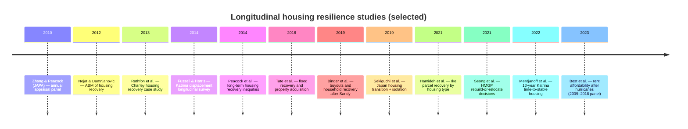

# Interdisciplinary longitudinal academic studies of housing resilience from 2006 to present

## Executive summary

Housing resilience research that is genuinely **longitudinal** (repeated measures over time) and **housing-centered** is concentrated in a few overlapping streams: (a) **post-disaster housing recovery trajectories** using parcel/administrative data, (b) **longitudinal cohort or panel studies** tracking displacement and return to stable housing, (c) **housing affordability and availability panels** that follow market conditions after hazards, and (d) **property-acquisition and mobility studies** that track how buyouts, rebuilding, and relocation shape long-term housing outcomes.

Across these streams, “housing resilience” is typically operationalized as one or more of: **time to stable/permanent housing**, **housing recovery speed/trajectory** (repairs, rebuilding, habitability proxy measures), or the **ability of housing systems to maintain affordability and availability under hazard shocks**.

The strongest interdisciplinary, longitudinal evidence base is dominated by studies of **hurricanes and floods** in the United States (especially New Orleans, Florida, Iowa, New Jersey/New York, and the Gulf/Atlantic coasts) plus a smaller set of longitudinal housing-transition studies in Japan after the 2011 Great East Japan Earthquake and tsunami.

Evidence availability is a persistent constraint. Several studies rely on public administrative inputs, surveys, or program records, but harmonized longitudinal panels and reusable replication packages are rarely released alongside the articles.

## Scope and methods

This review targets **peer-reviewed journal articles (2006–present)** that meet all of the following conditions:

- **Longitudinal design**: repeated observations over time (e.g., panel/cohort surveys, annual parcel assessments, time-to-event/survival analysis, multi-year panels, or explicitly time-stepped recovery models).
- **Housing resilience as a central focus**: housing recovery, displacement duration, transitions across temporary/permanent housing, or housing affordability/availability as a recovery pathway.
- **Interdisciplinary**: explicitly cross-field teams (e.g., engineering + planning + geography), or mixed-method/combined constructs where interdisciplinarity is defensible by inference.

The corpus was assembled through open-web discovery rather than a database-native systematic search. Where full text was unavailable, the report uses verified bibliographic metadata and cautious method-level descriptions rather than treating the record as fully reviewed.

## Comparative evidence map

### Table of longitudinal housing resilience studies and key attributes

| Study (abbr.) | Location | Longitudinal timeframe | Sample size | Disciplines involved | Resilience construct / measure | Main findings (high level) | Evidence basis |
|---|---|---|---:|---|---|---|---|
| Best et al. (2023) | 19 coastal states (East + Gulf Coasts), United States | 2009–2018 county panel | County-year panel | Civil/environmental engineering; planning; geography | Rent affordability ratio + median rent; hurricane exposure and lags | More intense prior-year hurricanes linked to higher median rents via reduced housing availability; hurricanes reduce affordable rental housing in places with higher shares of renters and people of color | Full article available in corpus |
| Hamideh et al. (2021) | Galveston, Texas | Eight-year post-Hurricane Ike parcel window | Parcel-level housing observations | Urban planning; hazards; housing markets; parcel analytics | Recovery trajectories by housing type | Multifamily and duplex units recovered more slowly than single-family after controlling for damage and neighborhood socioeconomic context | Verified bibliographic record; full-text confirmation needed for sample details |
| Peacock et al. (2014) | Miami and Galveston | Multi-year annual tax appraisal panels | Administrative housing records | Planning; social vulnerability; administrative housing data | Long-term housing recovery inequities | Race/ethnicity predicted higher damages and slower recovery in Miami, while income was most important in Galveston | Verified bibliographic record and secondary summaries |
| Zhang & Peacock (2010) | Miami-Dade County, Florida | 1992–2000 annual appraisal panel | 60,299 single-family homes | Planning; disaster recovery; housing analytics | Post-disaster housing recovery via appraisal-based indicators | Recovery planning after Hurricane Andrew requires attention to uneven abandonment, sales, and repair trajectories | Verified bibliographic record |
| Fussell & Harris (2014) | New Orleans, Louisiana | Pre-Katrina baseline to 8–18 months post-event follow-up | N=384 baseline; N=308 follow-up; analytic N=302 | Sociology; demography; disaster policy | Housing displacement vs return; tenure and assistance resources | Homeownership and disaster assistance protected against displacement; renters, especially subsidized housing residents, were more vulnerable | Full article available in corpus |
| Merdjanoff et al. (2022) | Louisiana and Mississippi | 13-year follow-up after Hurricane Katrina | n=1079 | Public health; social science; disaster science | Time to stable housing via survival analysis | Median time to stable housing was reported as 1082 days; tenure, income, age, marital status, and social support shaped time to stability | Verified bibliographic record |
| Sekiguchi et al. (2019) | Miyagi Prefecture, Japan | Baseline 2015; follow-ups 2016–2017 | n=393; propensity-score matched n=178 | Public health; epidemiology; housing reconstruction policy | Housing transition and social isolation | Moving to public reconstruction housing was associated with worsening social isolation over time relative to remaining in prefabricated temporary housing | Full article available in corpus |
| Rathfon et al. (2013) | Punta Gorda, Florida | Post-Hurricane Charley recovery case window | Housing recovery case-study records | Engineering; disaster recovery measurement; applied planning | Quantitative post-disaster housing recovery assessment | Provides an early quantitative case-study approach for tracking post-disaster housing recovery | Verified bibliographic record |
| Tate et al. (2016) | Cedar Rapids, Iowa | Post-2008 flood recovery and acquisition period | Property-acquisition and recovery records | Geography; hazards; planning; flood recovery policy | Flood recovery and property acquisition | Property acquisition is treated as both recovery pathway and mitigation intervention, with implications for neighborhood recovery and relocation | Full article available in corpus |
| Binder et al. (2019) | Hurricane Sandy-affected neighborhoods | Three years after Hurricane Sandy | Household/neighborhood recovery observations | Sociology; hazards; housing recovery | Home buyouts and household recovery | Buyout experiences and recovery outcomes vary across neighborhoods, showing that retreat policies produce uneven household recovery pathways | Full article available in corpus |
| Seong et al. (2021) | Hazard Mitigation Grant Program recipient contexts | Long-term rebuilding or relocation decisions | HMGP recipient records / survey evidence | Planning; hazards; sustainability; housing policy | Rebuild-or-relocate mobility decisions | Long-term mobility decisions among recipients show that mitigation-program exposure can shape whether households rebuild, relocate, or remain at risk | Full article available in corpus |

### Timeline snapshot of included longitudinal publications



### Mermaid flowchart of disciplinary connections

```mermaid
flowchart LR
 Haz[Hazard shock<br/>(hurricane, earthquake, flood)] --> Hsys[Housing system outcomes<br/>(repair, return, stability, affordability)]
 Hsys --> Res[Housing resilience constructs<br/>(time-to-stable, recovery trajectory, affordability)]

 subgraph Disciplines
 Eng[Civil/Infrastructure Engineering]
 Plan[Urban & Regional Planning]
 Geo[Geography / GIS]
 Soc[Sociology / Demography]
 PH[Public Health / Epidemiology]
 Econ[Economics / Housing markets]
 end

	 Eng -->|parcel recovery<br/>damage and habitability models| Res
 Plan -->|planning + equity lenses| Res
 Geo -->|spatial exposure + neighborhoods| Res
 Soc -->|tenure, displacement, inequality| Res
 PH -->|well-being impacts<br/>cohort designs| Res
 Econ -->|rents, prices, affordability| Res

 Data[Longitudinal data sources] --> Res
 Data -->|parcel appraisal / permits| Plan
 Data -->|panel & cohort surveys| Soc
 Data -->|health follow-ups| PH
 Data -->|multi-state panels| Econ
```

## Annotated catalog of peer-reviewed longitudinal studies

**Best, K. B., He, Q., Reilly, A., Tran, N., & Niemeier, D. (2023). _Rent affordability after hurricanes: Longitudinal evidence from US coastal states._ Risk Analysis. DOI: 10.1111/risa.14224.** This county-level panel follows rent affordability and median rent across 19 U.S. East and Gulf Coast states from 2009 to 2018. It extends housing resilience beyond repair status by showing how hurricane exposure can reduce affordable rental availability, especially where renters and people of color are already overrepresented.

**Hamideh, S., Peacock, W. G., & Van Zandt, S. (2021). _Housing type matters for pace of recovery: Evidence from Hurricane Ike._ International Journal of Disaster Risk Reduction, 57, Article 102149. DOI: 10.1016/j.ijdrr.2021.102149.** This parcel-level study follows Galveston housing recovery after Hurricane Ike and compares recovery trajectories across single-family, duplex, and multifamily housing. Its central contribution is to show that housing type matters for recovery speed even after accounting for damage and neighborhood socioeconomic context.

**Peacock, W. G., Van Zandt, S., Zhang, Y., & Highfield, W. E. (2014). _Inequities in Long-Term Housing Recovery After Disasters._ Journal of the American Planning Association, 80(4), 356–371. DOI: 10.1080/01944363.2014.980440.** This administrative-data study uses long-term housing recovery records from Miami and Galveston to show that recovery is socially differentiated. It anchors the longitudinal literature’s equity claim: recovery curves are not only technical outcomes, but expressions of race, income, vulnerability, and local housing systems.

**Zhang, Y., & Peacock, W. G. (2010). _Planning for Housing Recovery? Lessons Learned from Hurricane Andrew._ Journal of the American Planning Association, 76(1), 5–24. DOI: 10.1080/01944360903294556.** Using annual appraisal data for 60,299 single-family homes in Miami-Dade County from 1992 to 2000, this article demonstrates how administrative panels can track post-disaster housing recovery over time. It remains a key planning-oriented example of how repair, sales, abandonment, and neighborhood conditions can be analyzed longitudinally.

**Fussell, E., & Harris, E. (2014). _Homeownership and Housing Displacement after Hurricane Katrina among Low-Income African-American Mothers in New Orleans._ Social Science Quarterly, 95(4), 1086–1100. DOI: 10.1111/ssqu.12114.** This longitudinal survey follows low-income mothers from before Hurricane Katrina to 8–18 months after the event. It shows that tenure and recovery resources shape displacement outcomes, with homeowners and households receiving assistance less likely to remain displaced than renters, especially subsidized housing residents.

**Merdjanoff, A. A., Abramson, D. M., Park, Y. S., & Piltch-Loeb, R. (2022). _Disasters, Displacement, and Housing Instability: Estimating Time to Stable Housing 13 Years after Hurricane Katrina._ Weather, Climate, and Society, 14(2), 535–550. DOI: 10.1175/WCAS-D-21-0057.1.** This cohort analysis models time to stable housing over 13 years after Katrina. Its contribution is to make housing stability a time-to-event outcome, showing that recovery can take years and is shaped by tenure, income, marital status, age, and social support.

**Sekiguchi, T., Hagiwara, Y., Sugawara, Y., Tomata, Y., Tanji, F., Yabe, Y., Itoi, E., & Tsuji, I. (2019). _Moving from prefabricated temporary housing to public reconstruction housing and social isolation after the Great East Japan Earthquake: a longitudinal study using propensity score matching._ BMJ Open, 9(3), e026354. DOI: 10.1136/bmjopen-2018-026354.** This longitudinal public-health study follows survivors in Miyagi Prefecture after the 2011 earthquake and tsunami. It shows that moving from prefabricated temporary housing to public reconstruction housing can worsen social isolation, reminding housing-resilience researchers that a “permanent” housing outcome can still undermine social recovery.

**Rathfon, D., Davidson, R., Bevington, J., Vicini, A., & Hill, A. (2013). _Quantitative assessment of post-disaster housing recovery: A case study of Punta Gorda, Florida, after Hurricane Charley._ Disasters, 37(2), 333–355. DOI: 10.1111/j.1467-7717.2012.01305.x.** This case study develops a quantitative approach for assessing post-disaster housing recovery after Hurricane Charley. It contributes to the longitudinal stream by treating recovery as an observable process that can be tracked across a defined post-event period rather than as a single end-state.

**Tate, E., Strong, A., Kraus, T., & Xiong, H. (2016). _Flood Recovery and Property Acquisition in Cedar Rapids, Iowa._ Natural Hazards, 80, 2055–2079. DOI: 10.1007/s11069-015-2060-8.** This study brings property acquisition into the longitudinal evidence base by examining flood recovery and buyout pathways after the 2008 Cedar Rapids flood. It shows that acquisition is not merely mitigation; it is also a housing recovery pathway that shapes household mobility, neighborhood change, and long-term exposure.

**Binder, S. B., Greer, A., & Zavar, E. (2019). _Home Buyouts and Household Recovery: Neighborhood Differences Three Years After Hurricane Sandy._ Environmental Hazards, 18(2), 127–145. DOI: 10.1080/17477891.2018.1511404.** This study tracks household recovery three years after Sandy and compares neighborhood differences in buyout contexts. It strengthens the policy-exposure dimension of the longitudinal corpus by showing that retreat programs produce uneven household recovery experiences rather than a uniform path to safety.

**Seong, K., Losey, C., Gu, D., & Sutley, E. J. (2021). _To Rebuild or Relocate: Long-Term Mobility Decisions of Hazard Mitigation Grant Program (HMGP) Recipients._ Sustainability, 13(16), Article 8754. DOI: 10.3390/su13168754.** This study examines long-term mobility decisions among mitigation-program recipients, asking whether households rebuild or relocate. It is central to the longitudinal report because it connects individual housing trajectories to program exposure, showing that policy design can shape recovery mobility long after the event.

## Cross-study synthesis

A consistent empirical pattern across the longitudinal **administrative/parcel** stream is that housing recovery is **heterogeneous** by housing type, neighborhood condition, and socioeconomic context, suggesting that “housing resilience” is not well-described by a single community-average recovery curve. In Galveston after Hurricane Ike, an eight-year parcel-based analysis reports slower recovery for multifamily units and duplexes compared with single-family homes, even after controlling for damage and neighborhood socioeconomic characteristics. Earlier appraisal- and case-study work shows the same broader lesson: recovery trajectories depend on local housing markets, abandonment and sales dynamics, and the administrative systems used to track repair.

The longitudinal **cohort/panel** stream underscores that “housing resilience” can be meaningfully represented as **time-to-stability**, not only “whether return occurs.” A cohort-based survival analysis of Katrina-exposed residents reports a median time to stable housing on the order of years (1082 days), with tenure, income, and social support shaping the hazard of reaching stability. In a different longitudinal design with a short-to-medium horizon (8–18 months), pre-disaster tenure and post-disaster resources (private insurance and FEMA assistance) explain unequal housing displacement outcomes among low-income mothers in New Orleans.

A growing interdisciplinary strand treats housing resilience not only as “rebuild/return,” but as the ability to sustain **affordability** under hazard shocks. A multi-state coastal county panel (2009–2018) links hurricane intensity and occurrence to rent and affordability dynamics, explicitly framing renter vulnerability as a function of exposure, physical vulnerability of structures, and socioeconomic disadvantage. This expands the housing resilience concept from “repair status” toward “housing stability and access” as an evolving system property.

The Japan-focused longitudinal housing-transition study illustrates how housing resilience can include **social integration and well-being** consequences of reconstruction pathways. Moving from prefabricated temporary housing to public reconstruction housing was associated with worsening social isolation over time, emphasizing that the “end state” of permanent housing can still embed resilience risks if social networks are disrupted.

The buyout and property-acquisition studies add an essential policy-exposure stream. Tate et al. (2016), Binder et al. (2019), and Seong et al. (2021) show that acquisition, rebuilding, and relocation are not peripheral to housing recovery; they are longitudinal housing trajectories shaped by federal mitigation programs, neighborhood context, and household mobility decisions. This evidence corrects a narrow repair-only interpretation of longitudinal housing resilience by making program exposure and managed retreat part of the recovery record.

## Gaps and recommendations

A notable gap is the shortage of longitudinal studies that simultaneously track **(1) physical housing repair/habitability**, **(2) household socioeconomic trajectories**, and **(3) policy/program exposure** (insurance, grants, buyouts, landlord decisions) in a single linked dataset. The added acquisition and mobility studies strengthen the program-exposure dimension, but the studies above still tend to excel in one dimension rather than integrate physical, social, and policy pathways end to end.

A second gap is weak transparency and reuse: even when researchers rely on public inputs (tax appraisal, HUD rents, standard hurricane exposure products), the resulting harmonized longitudinal panels are seldom released as public data products; where data sharing is offered, it is frequently “upon request,” which is brittle for cumulative science.

A third gap is limited coverage of **rental, multifamily, and subsidized housing** as first-class objects of longitudinal housing resilience analysis, despite repeated evidence that renters and multifamily housing can face heightened disadvantage in recovery and stability pathways.

A fourth gap is geographic: high-quality longitudinal housing resilience evidence is heavily concentrated in the U.S. hurricane context, with a much thinner peer-reviewed longitudinal base for other world regions and for hazards beyond coastal storms, despite clear relevance for earthquake- and flood-prone contexts.

Recommendations for future research follow directly:

- Develop **open, linkable longitudinal housing recovery panels** that connect parcel/building records (repair/rebuild proxies), assistance program participation, and neighborhood sociodemographics, with governance to protect privacy while enabling replication.
- Standardize housing resilience outcome measures into a small set of comparable constructs: **time-to-habitability**, **time-to-stable occupancy**, **affordability recovery**, and **distributional equity of recovery** (e.g., quantile recovery curves).
- Expand longitudinal designs to explicitly include **rental housing and landlord decision-making**, including multifamily repair timelines and tenant displacement durations.
- Combine administrative and cohort approaches: embed “housing modules” in long-running cohorts (public health or social panels) and, conversely, embed household surveys into administrative recovery tracking so that physical and social recovery are analyzed as a coupled system.
