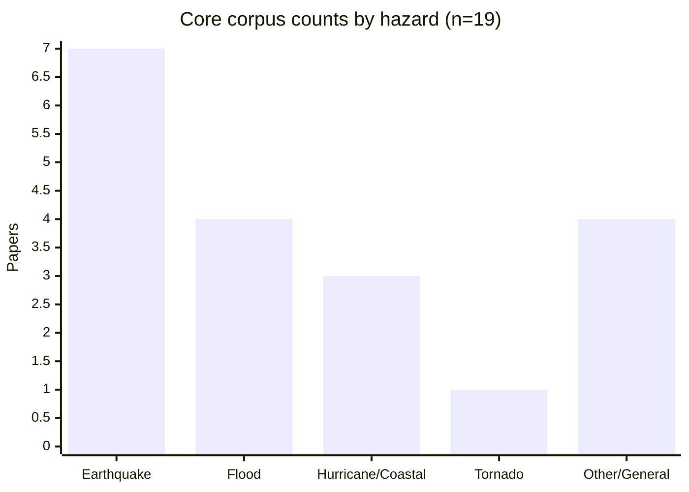
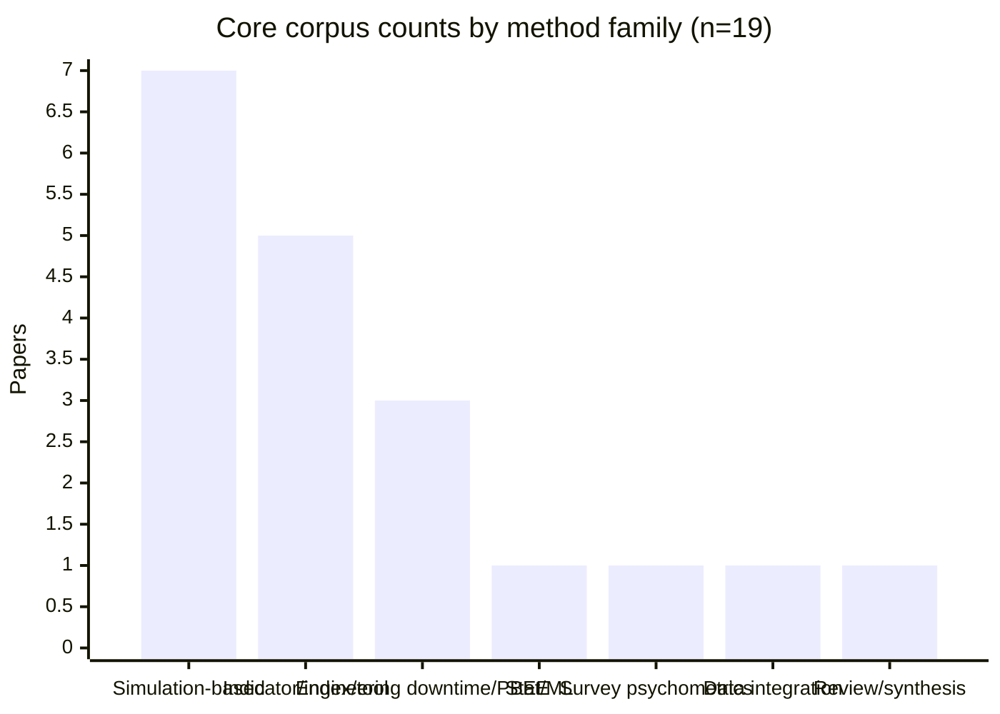
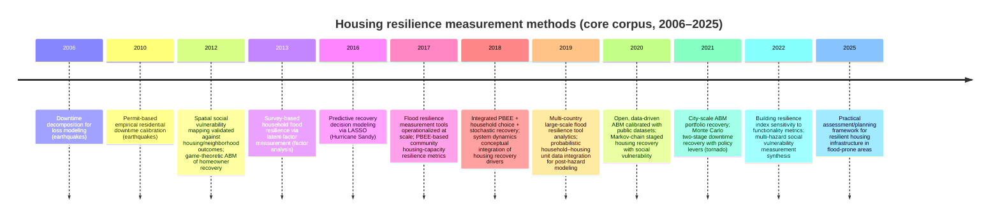

# Academic Measurement of Housing Resilience in Hazards and Disasters

## Executive summary

This report synthesizes peer‑reviewed and refereed research from 2006–2026 that **explicitly measures or operationalizes “housing resilience”**—defined here as the capacity of housing units/building portfolios/households to **withstand hazard impacts, maintain habitability/functionality, and recover (reoccupy/repair/return) over time**. The emphasis is on **empirical measurement studies** and **operational assessment models** (e.g., downtime quantification, recovery simulation, indicator tools, and statistical models).

A **core corpus of 19 studies** was assembled and coded with consistent fields: full bibliographic metadata (authors/year/title/venue/volume/issue/pages/DOI), 2–3 sentence summaries, measurement methodology, metrics/indicators, data sources, geographic focus, hazard type, key findings, limitations, and access status. The corpus is intentionally “measurement-forward”: every included paper either (a) proposes a measurable resilience metric/index for housing (or housing capacity), (b) implements an empirical/simulation pipeline that produces resilience outputs such as downtime, staged recovery trajectories, or probability distributions of household recovery outcomes, or (c) reviews measurement constructs such as social vulnerability where those constructs are used to assess housing and neighborhood resilience.

A consistent pattern across engineering and social-science approaches is that **“housing resilience” rarely equals “structural safety”**; instead, it is frequently quantified as **time-dependent functionality/habitability** (downtime; occupancy capacity), **decision-driven recovery trajectories** (agent-based/Monte Carlo/system dynamics), or **indicator-based resilience sources** (capitals-based flood tools; social vulnerability mapping), each with distinct data needs and validity challenges.

The source of record for the coded corpus is the project bibliography. The counts and tables below summarize the 19 measurement-theme entries currently assigned to this report.

## Scope of housing resilience measurement

“Housing resilience” in the reviewed literature is operationalized at three main analytical levels:

At the **housing unit / building level**, resilience is often quantified via **downtime** (time to reoccupy/repair) or the **area under a functionality/occupancy curve** that reflects loss and recovery dynamics after the hazard event.

At the **portfolio/community level**, housing resilience appears as **aggregate occupancy/housing-capacity** (e.g., shelter-in-place capacity) and its recovery over time under varying building performance assumptions and interventions.

At the **household level**, resilience is quantified through (i) **observed or modeled recovery decisions** (repair/rebuild/relocate), (ii) **staged transitions** through shelter/temporary/permanent housing, or (iii) **survey-derived latent factors** representing perceived coping and adaptive capacity.

Hazards represented in the core corpus include earthquakes, floods, hurricanes/coastal storms, and tornadoes, with some models framed as hazard-agnostic “post-disaster housing recovery” mechanisms.

## Search strategy and screening criteria

### Search strategy

The corpus was assembled through open-web discovery rather than a database-native systematic search. Retrieval therefore relied on Google Scholar-style keyword searching, DOI-anchored validation on publisher pages (e.g., SAGE, Copernicus, ScienceDirect), and targeted snowballing through reference lists.

Keyword families (iteratively refined) included combinations of:
- “housing resilience” + (measure OR index OR assessment OR quantification) 
- “post-disaster housing recovery” + (model OR simulation OR agent-based OR Markov OR Monte Carlo) 
- “downtime” + (residential buildings) + hazard terms (earthquake/flood/hurricane/tornado) 
- “flood resilience measurement tool” and “social vulnerability” + housing/neighborhood resilience 

### Inclusion and exclusion criteria

Included studies met all of the following:
- Publication year 2006–2026 inclusive. 
- Peer-reviewed journal article or refereed conference/proceedings paper. 
- Explicit operationalization of housing resilience through **quantitative measures**, **indices**, **modeled recovery trajectories**, or **validated indicator-based tools** that meaningfully include housing or housing capacity.

Excluded (from the coded core corpus) were:
- Purely conceptual “resilience” discussions without measurable outputs. 
- Papers on general infrastructure resilience that do not clearly include housing or residential building recovery metrics. 
- Studies focused only on structural response without linking to functionality, occupancy, downtime, or recovery.

## Evidence map and trends

### Counts by year, hazard, region, and methodology

The coded core corpus contains **n = 19** studies (earliest 2006; latest 2025) with the following distribution by year (counts reflect this corpus, not the global universe of papers):

| Year | Papers |
|---:|---:|
| 2006 | 1 |
| 2010 | 1 |
| 2012 | 2 |
| 2013 | 1 |
| 2016 | 1 |
| 2017 | 2 |
| 2018 | 2 |
| 2019 | 2 |
| 2020 | 2 |
| 2021 | 2 |
| 2022 | 2 |
| 2025 | 1 |

Hazard coverage in the corpus is dominated by earthquakes and floods, with hurricanes/coastal storms and tornado represented as well.

Methodologically, the literature splits into several measurement “families”:
- Engineering **downtime/functionality** metrics and **PBEE-derived** housing-capacity measures. 
- **Simulation-based recovery modeling** (agent-based, Monte Carlo, Markov chains, integrated PBEE + household choice). 
- **Indicator and index approaches**, including multi-capital flood tools and social vulnerability mapping validated against outcomes. 
- Statistical learning on observed recovery decisions (e.g., LASSO). 
- Review/synthesis work, including Drakes & Tate (2022), that consolidates social vulnerability measurement across multiple hazards and clarifies how vulnerability constructs are used in housing and neighborhood resilience assessment.

### Timeline of method evolution in the core corpus

## Annotated core corpus with key measurement details

The project bibliography contains the full coded fields for all 19 papers and can be filtered or pivoted by hazard, region, and method category.

Below is an **at-a-glance catalog** of the same core corpus, with each entry pointing to the primary source used to extract metadata and abstracts/summaries.

| Year | Title | Venue | DOI | Hazard | Region (short) | Measurement approach (very short) | Access |
|---:|---|---|---|---|---|---|---|
| 2006 | Estimating Downtime in Loss Modeling | Earthquake Spectra 22(2):349–365 | 10.1193/1.2191017 | Earthquake | US | Downtime conceptual + empirical decomposition | Paywalled |
| 2010 | Estimating Downtime from Data on Residential Buildings after the Northridge and Loma Prieta Earthquakes | Earthquake Spectra 26(4):951–965 | 10.1193/1.3477993 | Earthquake | US | Permit-record empirical downtime calibration | Paywalled |
| 2012 | Mapping social vulnerability to enhance housing and neighborhood resilience | Housing Policy Debate 22(1):29–55 | 10.1080/10511482.2011.624528 | Hurricane | US | Vulnerability mapping validated vs recovery outcomes | Paywalled |
| 2012 | Agent-Based Modeling of Behavioral Housing Recovery Following Disasters | Computer-Aided Civil and Infrastructure Engineering 27(10):748–763 | 10.1111/j.1467-8667.2012.00787.x | General | — | ABM + game-theoretic neighbor-signal decisions | Paywalled |
| 2013 | Measuring household resilience to floods: Vietnamese Mekong River Delta | Ecology and Society 18(3):13 | 10.5751/ES-05427-180313 | Flood | Vietnam | Survey items + factor analysis latent resilience dimensions | OA |
| 2016 | LASSO Model of Postdisaster Housing Recovery: Hurricane Sandy | Natural Hazards Review 17(3):04016007 | 10.1061/(ASCE)NH.1527-6996.0000223 | Hurricane | US | LASSO predictive model for repair/rebuild/relocate | Paywalled |
| 2017 | Development and testing of a community flood resilience measurement tool | NHESS 17(1):77–101 | 10.5194/nhess-17-77-2017 | Flood | Global | Indicator tool (capitals) field tested | OA |
| 2017 | Seismic resilience of a residential community via enhanced building performance | Earthquake Spectra 33(4):1347–1367 | 10.1193/040916EQS057M | Earthquake | — | PBEE-linked community “housing capacity” metric | Paywalled |
| 2018 | An interdisciplinary system dynamics model for post-disaster housing recovery | Sustainable & Resilient Infrastructure 3(3):1–19 | 10.1080/23789689.2017.1364561 | General | — | System dynamics causal model (integrated drivers) | Paywalled |
| 2018 | Integrating PBEE and urban simulation to model post-earthquake housing recovery | Earthquake Spectra 34(4):1763–1785 | 10.1193/041017EQS067M | Earthquake | — | PBEE + household choice + stochastic recovery trajectories | Paywalled |
| 2019 | First insights from the Flood Resilience Measurement Tool | IJDRR 40:101257 | 10.1016/j.ijdrr.2019.101257 | Flood | Global | Mixed-method indicator scoring + outcome measures | Paywalled |
| 2019 | Household/housing-unit data integration for post-hazard resilience modeling | Sustainable & Resilient Infrastructure 6(2):1–17 | 10.1080/23789689.2019.1681821 | Multi-hazard | US | Probabilistic housing-unit allocation + infrastructure linkage | Paywalled |
| 2020 | RecovUS: An Agent-Based Model of Post-Disaster Household Recovery | JASSS 23(4):13 | 10.18564/jasss.4445 | Hurricane | US | Open-data spatial ABM calibrated to Sandy case | OA |
| 2020 | Postdisaster Housing Stages: Markov chain sequences/duration by social vulnerability | Risk Analysis 40(12):2675–2695 | 10.1111/risa.13576 | Earthquake (scenario) | — | Markov chain + Monte Carlo on staged recovery | Paywalled (likely) |
| 2021 | Agent-based model for post-earthquake housing recovery | Earthquake Spectra 37(1):46–72 | 10.1177/8755293020944175 | Earthquake | Canada | Portfolio ABM capturing resource competition | Paywalled |
| 2021 | Quantitative modeling of residential building disaster recovery and policy effects | IJDRR 59:102259 | 10.1016/j.ijdrr.2021.102259 | Tornado | US | Monte Carlo two-stage downtime (delay+repair) + policy levers | OA |
| 2022 | Functionality measures for quantification of building seismic resilience index | Engineering Structures 253:113800 | 10.1016/j.engstruct.2021.113800 | Earthquake | US | Resilience index based on functionality curve sensitivity | Author PDF used |
| 2022 | Social Vulnerability in a Multi-Hazard Context: A Systematic Review | Environmental Research Letters | 10.1088/1748-9326/ac5140 | Multi-hazard | — | Systematic review of social vulnerability constructs across hazards | OA |
| 2025 | A practical framework for ensuring resilient housing infrastructure in flood-prone areas | IJDRR 119:105297 | 10.1016/j.ijdrr.2025.105297 | Flood | — | Flood-prone housing infrastructure resilience framework | Paywalled (likely) |

## Methodological gaps and limitations

### Cross-method comparability remains weak

A major barrier to cumulative knowledge is that “resilience” is quantified using **non-equivalent measures**: some studies measure **downtime to reoccupancy** from permits, others integrate a **functionality curve** into a resilience index, and still others quantify **stage-based trajectories** (shelter → permanent housing) or **indicator “sources”** of resilience. These measures operate at different scales and can disagree in ranking “more resilient” cases.

### Validation is frequently the limiting step

Several models explicitly rely on assumptions about impeding factors, transition probabilities, or household decision rules; without longitudinal datasets, their outputs can be hard to validate. This limitation is often acknowledged directly (e.g., “beyond current capabilities to quantify such complexities” in system dynamics framing, or reliance on hypothetical/policy scenarios in Monte Carlo recovery models).

### Housing-system equity is measurable but data-intensive

Equity-aware housing resilience modeling increasingly requires **household-to-housing-unit linkage** and rich socio-demographic attributes to avoid ecological fallacy and to quantify distributional impacts (e.g., displacement and unequal recovery). The availability of probabilistic allocation workflows is a step forward, but correlation structure and uncertainty propagation remain open challenges.

### Limitations of this review

This report is a **high‑precision, measurement‑focused scan** built through open-web discovery and snowballing. It is not guaranteed exhaustive relative to subscription-indexed retrieval in Web of Science or Scopus, and it likely undercounts conference proceedings and recent papers not well indexed on open pages. The coded corpus should therefore be treated as a **replicable starting dataset** for extension with formal database queries.
